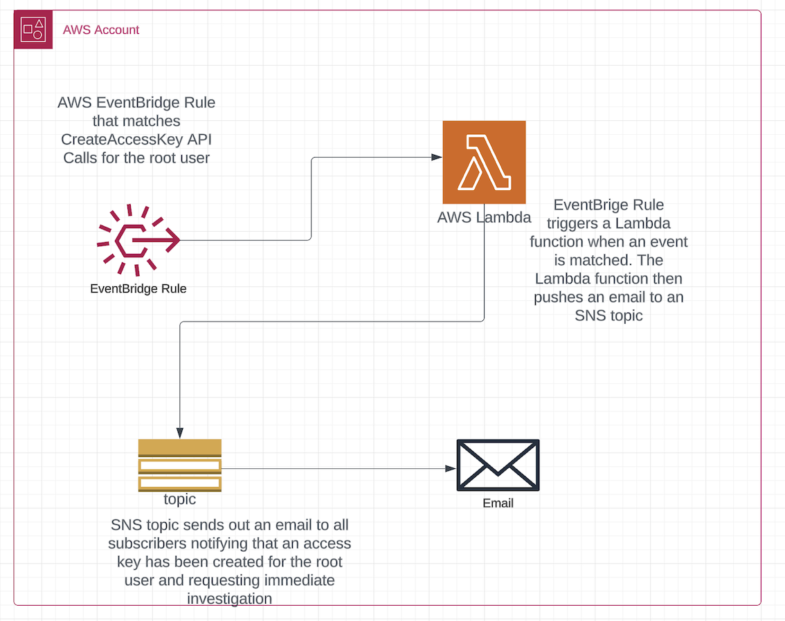

### Root User Access Key Creation Detection

AWS Account Management best practice recommend not to use the root user in an AWS account for day-to-day administration. AWS explicitly states for you not to create access keys to grant programmatic access to the root user. This is sensible advice, if you consider that the root user has pretty much unrestricted powers within an AWS account (<https://docs.aws.amazon.com/accounts/latest/reference/best-practices-root-user.html>). If programmatic access is granted to the root user, an attacker who manages to compromise such credentials will have unrestricted access to all resources within the AWS account.

The idea here is to design a system that will detect when access keys are created for the root user and notify a security team to investigate. The current design uses AWS EventBridge, Lambda, and SNS. An EventBridge rule will detect API calls to create access keys for the root user and trigger a Lambda function. This Lambda function will push an email to an SNS topic that a security team subscribes to be alerted for such an event.

If an AWS account has been set up according to the recommendations set up in the security pillar of the AWS well architected framework, then the root user account should be properly locked down and the probability that an access key can be created for the root user should be very low. An argument can be made whether there is any point to building detections for such extremely low probability events?  Because the compromise of the root user can have catastrophic consequences, I submit that this is a very good detection to alert on.
